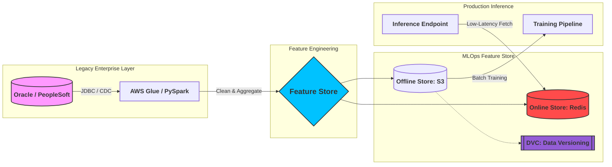

```mermaid
graph LR
    %% Global Styling for Larger Text
    classDef largeText font-size:18px,font-weight:bold,stroke-width:2px;
    classDef headerText font-size:22px,font-weight:bold,fill:#fff,stroke:#333;

    subgraph "Legacy Enterprise Layer"
        DB[(Oracle / PeopleSoft)]:::largeText -- "JDBC / CDC" --> Glue:::largeText
    end

    subgraph "Feature Engineering"
        Glue[AWS Glue / PySpark]:::largeText -- "Clean & Aggregate" --> FS:::largeText
    end

    subgraph "MLOps Feature Store"
        direction TB
        FS{Feature Store}:::headerText
        Offline[(Offline Store: S3)]:::largeText
        Online[(Online Store: Redis)]:::largeText
        DVC[[DVC: Data Versioning]]:::largeText
        
        FS --> Offline
        FS --> Online
        Offline -.-> DVC
    end

    subgraph "Production Inference"
        Model[Inference Endpoint]:::largeText -- "Low-Latency Fetch" --> Online
        Offline -- "Batch Training" --> Training[Training Pipeline]:::largeText
    end

    %% Color Styling
    style DB fill:#f9f,stroke:#333
    style FS fill:#00c2ff,stroke:#333
    style Online fill:#ff4b4b,stroke:#333
    style DVC fill:#945dd6,stroke:#333
```
